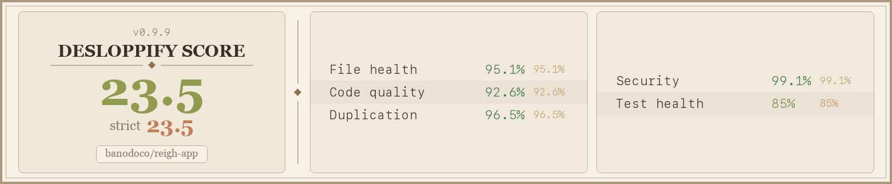

# Reigh

AI-powered image and video generation studio. **For usage, go to [reigh.art](https://reigh.art/)** — this repo is for development only.

---

## Tech Stack

React + Vite + TypeScript · TailwindCSS + shadcn-ui · Supabase (Postgres, Auth, Storage, Edge Functions)

## Quick Start

**Prerequisites:** Node.js 20.19.4 with npm 10.8.2 for this closeout branch,
Docker, and [Supabase CLI v1+](https://supabase.com/docs/guides/cli)

```bash
git clone https://github.com/peteromallet/reigh
cd reigh && npm install

cp .env.example .env.local    # required VITE_* vars, each commented
supabase start                # launches Postgres, Auth, Storage, Realtime
# copy the printed SUPABASE_URL, ANON_KEY & SERVICE_ROLE_KEY into .env.local
supabase db push              # applies migrations

npm run dev                   # Vite on http://localhost:2222
```

**Timeline only?** `npm run dev:editor` boots the video-editor timeline with demo
clips against a committed local bridge stub — no Docker, no Supabase, no sign-in.
It prints the editor URL; open it and the timeline is there.

GPU task processing requires **[Reigh-Worker](https://github.com/banodoco/Reigh-Worker)** running separately. Worker and API orchestration is managed by **[Reigh-Worker-Orchestrator](https://github.com/banodoco/Reigh-Worker-Orchestrator)**.

For the local Astrid stack, follow the existing [local runtime execution
plan](docs/local-runtime/README.md). Runtime owns the workspace realm and
worker lifecycle; the app consumes the authenticated Runtime boundary and does
not open SQLite/CAS state. The Plan A CPU qualification uses the fake-engine
worker path and excludes CUDA, provider, RunPod, and VibeComfy extras.

### Pair the managed local workspace

Create or start the Astrid workspace first, then point the local connector at
the relay:

```bash
astrid setup --create --apply --offline \
  --workspace-id "$WORKSPACE_ID" \
  --data-root "$ASTRID_LOCAL_DATA_ROOT" \
  --realm-root "$ASTRID_REALM_ROOT" --json

export REIGH_PAIRED_RELAY_ORIGIN=https://your-relay.example
npm run dev:local -- --paired
```

Runtime discovery points at the owner-only `credentials/astrid.json` product
credential. The launcher derives its authenticated `actor_id`; do not provide
an owner, admin, or Worker credential. `REIGH_PAIRED_PRODUCT_ACTOR` is an
optional consistency check and must exactly match that actor when set.
`ASTRID_WORKSPACE_DISCOVERY`, `ASTRID_PRODUCT_TOKEN_FILE`,
`REIGH_PAIRED_REALM_ID`, and `REIGH_PAIRED_CONNECTOR_STATE` are explicit
deployment overrides. When `ASTRID_PRODUCT_TOKEN_FILE` is set, the launcher,
Vite proxy, and connector all use that same product credential. Use
`--reset-pairing` to replace only the local pairing state.

## Governance Contracts

- Supabase runtime contract: [`docs/governance/contracts/supabase-runtime.md`](docs/governance/contracts/supabase-runtime.md)
- Error handling contract: [`docs/governance/contracts/error-handling.md`](docs/governance/contracts/error-handling.md)
- Compatibility shims and migration gates: [`docs/governance/contracts/compatibility-shims.md`](docs/governance/contracts/compatibility-shims.md)
- Astrid Plan A C1 composition and handoff: [`docs/governance/contracts/astrid-plan-a.md`](docs/governance/contracts/astrid-plan-a.md)
- Astrid Plan A C1-S1 current-source successor: [`config/contracts/astrid-plan-a-c1-s1.json`](config/contracts/astrid-plan-a-c1-s1.json)

### Contract Status Matrix

| Contract Surface | Canonical Path | Compatibility Status | Removal Target |
|---|---|---|---|
| Supabase runtime accessor | `src/integrations/supabase/client.ts` | Stable canonical | N/A |
| Runtime error normalization | `src/shared/lib/errorHandling/runtimeError.ts` (`normalizeAndPresentError`) | Legacy `handleError.ts` aliases retired; zero-use guard remains | Complete |
| UI button entrypoint | `src/shared/components/ui/button.tsx` | Stable canonical for app imports | N/A |
| UI button primitive (base-only) | `src/shared/components/ui/contracts/button.tsx` | Canonical primitive contract behind `ui/button` | N/A |
| UI themed button wrapper | `src/shared/components/ui/theme/button.tsx` | App layer wrapper over base primitive | N/A |
| UI class merge primitive | `src/shared/components/ui/contracts/cn.ts` | Stable canonical | N/A |
| Video editor core SDK | `src/tools/video-editor/index.ts` | Stable edge-safe contract | N/A |
| Video editor browser helpers | `src/tools/video-editor/browser.ts` | Stable browser-only contract | N/A |
| Video editor browser provider | `src/tools/video-editor/browser-provider.ts` | Stable custom-shell browser contract | N/A |
| Video editor testing helpers | `src/tools/video-editor/testing.ts` | Stable testing contract | N/A |

The authoritative inventory of live compatibility paths, temporary host import
exceptions, and zero-use tombstones is
[`docs/governance/contracts/compatibility-shims.md`](docs/governance/contracts/compatibility-shims.md).

### Governance Test Gates

Run these in CI and before merging facade/contract changes:

- `npm run test:contracts`
- `npm run test:arch`
- `npm run quality:check`
- `npm run quality:extension-family-conformance`

### Gate-to-Surface Map

| Gate | Required Surface Coverage | Expected Assertion |
|---|---|---|
| `npm run check:astrid-contract-freeze` | `config/contracts/astrid-plan-a-c1.json`, `scripts/quality/check-astrid-contract-freeze.mjs`, `scripts/quality/lib/astrid-contract-schema.mjs`, `docs/governance/contracts/astrid-plan-a.md` | C1 schema, digest, references, frozen semantics and available declaration hashes; no installed acceptance claim |
| `npm run check:astrid-contract-successor` | `config/contracts/astrid-plan-a-c1-s1.json`, `scripts/dev-local-workspace.mjs`, `scripts/reigh-product-credential.mjs`, `scripts/reigh-local-connector.ts`, `scripts/reigh-product-credential.test.mjs`, `scripts/quality/check-astrid-contract-successor.mjs`, `scripts/quality/check-astrid-contract-successor.test.mjs`, `config/contracts/registry.json`, `docs/governance/contracts/astrid-plan-a.md` | C1-S1 authenticated product identity binding, exact source hashes, pending SL/EW acknowledgements and immutable C1 preservation |
| `npm run test:contracts` | `src/sdk/index.ts`, `src/tools/video-editor/index.ts`, `src/tools/video-editor/browser.ts`, `src/tools/video-editor/testing.ts`, `src/shared/components/ui/contracts/cn.ts`, `src/shared/lib/errorHandling/runtimeError.ts`, `src/domains/generation/types/index.ts` | Public contract API shape and behavior stays stable |
| `npm run test:arch` | `scripts/quality/check-video-editor-sdk-imports.mjs`, `scripts/quality/check-sdk-no-barrel-imports.mjs`, `config/governance/video-editor-sdk-import-allowlist.json`, `src/shared/lib/errorHandling/runtimeError.ts`, `src/integrations/supabase/client.ts`, `docs/governance/contracts/compatibility-shims.md` | Contract and shim usage rules are enforced |
| `npm run quality:check` | `src/sdk/index.ts`, `src/tools/video-editor/index.ts`, `src/tools/video-editor/browser.ts`, `src/tools/video-editor/testing.ts`, `scripts/quality/check-video-editor-sdk-imports.mjs`, `scripts/quality/check-sdk-public-exports.mjs`, `scripts/quality/check-sdk-no-barrel-imports.mjs`, `config/governance/video-editor-sdk-import-allowlist.json`, `config/governance/sdk-public-export-allowlist.json`, `src/integrations/supabase/client.ts`, `src/shared/lib/errorHandling/runtimeError.ts`, `src/shared/components/ui/contracts/cn.ts` | Integrated lint/typecheck/governance checks pass for touched contract surfaces |
| `npm run quality:extension-family-conformance` | `src/sdk/video/families/familyDefinitions.ts`, `src/sdk/video/families/familyDefinitions.test.ts`, `src/sdk/video/families/conformanceGate.test.ts`, `src/sdk/core/families/maturity.ts`, `src/sdk/core/families/conformance.ts` | Family registry/schema/conformance contract stays aligned |

## Code Health



## Documentation

| Doc | Purpose |
|-----|---------|
| **[structure.md](structure.md)** | Architecture overview, directory map, links to all sub-docs |
| **[docs/code_quality_audit.md](docs/code_quality_audit.md)** | Quality standards, anti-patterns, metrics, known exceptions |
| **[docs/video-editor-sdk/](docs/video-editor-sdk/README.md)** | Supported public SDK guide, recipes, and standalone embed demo references |
| **[CLAUDE.md](CLAUDE.md)** | AI agent instructions — working rules, routing table, conventions (symlinked to `.cursorrules`) |
| **[docs/structure_detail/](docs/structure_detail/)** | 24 focused sub-docs covering every system (settings, data fetching, realtime, tasks, etc.) |
