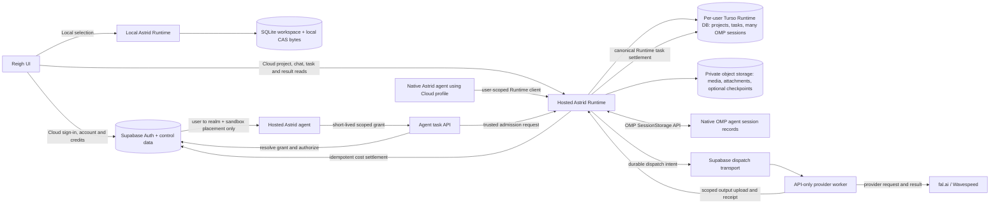

# Cloud mode integration plan

**Shared metaplan:** [Reigh Cloud — coordinated projects and execution schedule](/Users/peteromalley/Documents/reigh-workspace/reigh-app/docs/design/cloud-mode-megado-projects-2026-10-05.md).

**Status: Draft for engineering review — 2026-10-05**

For the decision register, precise reuse/source ledger, universal OMP persistence, claim-order correction and bounded prototype gates, see [Cloud mode specification readiness](cloud-mode-specification-readiness-2026-10-05.md). Its evidence ledgers are in [`cloud-mode-research-2026-10-05`](cloud-mode-research-2026-10-05/), including [billing/auth reuse](cloud-mode-research-2026-10-05/spec-billing-reuse.md), [Runtime/Turso/blob contracts](cloud-mode-research-2026-10-05/spec-runtime-contracts.md), and [agent execution](cloud-mode-research-2026-10-05/spec-agent-execution.md).

This plan adds a user-selectable Local/Cloud mode to Reigh while keeping Astrid Runtime as the canonical workspace and task system. Local mode uses the existing local Runtime, SQLite database, and local media bytes. Cloud mode uses a hosted Astrid Runtime backed by Turso for workspace state, private object storage for bytes, and Supabase for user authentication, credits and billing, user-to-realm mapping, separate execution-job transport, and hosted agent session placement/leases. The confirmed tenancy is one Turso database per user, with that user’s projects and personal workspace data in the user’s Runtime realm. Team/shared workspaces are deferred; do not present per-workspace databases or cross-user membership as settled. Use a new private Supabase Storage bucket behind a Runtime `BlobStore` interface as the initial object-store candidate; keep S3/R2-compatible backends possible without changing Runtime object identity. Existing `image_uploads` and `lora_files` policies include public-readable grants, so they are not suitable as the new tenant bucket by default. Each task is admitted once to one Runtime realm and stays pinned there. The data-mode choice is independent of where Astrid runs: native Astrid on the user laptop and hosted Astrid can both select the same Cloud profile, while Local selects local SQLite/CAS. The app switches which endpoint and data set it opens; it does not sync project state across modes or reroute in-flight work.

This document synthesizes current repository evidence and identifies proposals separately from existing code. Repository presence does not establish deployed service or live-schema state. No production database, secrets, migrations, object stores, or service deployments were inspected. The source evidence reports and their checkout caveats are in [`cloud-mode-research-2026-10-05`](cloud-mode-research-2026-10-05/).

## Current user decisions (2026-10-05)

Customer-agent inference starts on the DeepSeek API at `https://api.deepseek.com`, using `deepseek-flash` for DeepSeek-V4.1-Flash. It is a mutable alias; record the actual returned model/date and verify OMP tool calling, streaming, and usage reporting. See [DeepSeek API pricing/model alias documentation](https://api-docs.deepseek.com/quick_start/pricing). This does not alter Megado run-role configs. Terminal task success, failure, or cancellation produces a durable Runtime completion event and automatically continues the originating plan once. Project 03 owns the terminal task/outbox event; 04 owns deduplicated controller inbox delivery, native OMP notification, and follow-on turn; 06 owns waiting/resuming UI and joined proof. Queue behind an active turn/native writer; use a stable event ID, acknowledge only after native OMP write/flush, acquire the current writer and fresh grant, and resume from committed state. Respect cancel, stale lease, and account disable/revocation; do not retry terminal work or replay the old LLM turn. If credit is insufficient, retain the completion notification and show the result; wait for credit before admitting a paid follow-on turn. A completion after scratch expires may recreate a sandbox from durable state.

The user selected simple usage charging through one prepaid balance for measured model, allocated active-sandbox, generation, and render usage. Reserve an estimate, settle verified actual usage once, and release unused hold. Initial tariff recommendation for product confirmation: 1× measured underlying cost with 0% markup. Completed provider work is charged at measured usage even if its output is disliked; duplicate or infrastructure-fault charges are not silently passed through. Exact failed/cancelled/ambiguous-cost treatment remains a narrow tariff decision. No arbitrary daily spend, conversation/concurrency, or LLM-budget product quotas are planned; balance reservation, provider limits, scoped authorization, idempotency, one writer per conversation, and operator emergency stop remain technical safeguards. The accepted 24-hour paused-sandbox retention deletes scratch after durable Runtime/BlobStore state is confirmed and does not expire Turso history; the 90-second committed-idle pause remains provisional.


Local-to-Cloud movement should be an explicit user-started import/copy workflow, not mode-toggle behavior. Export a consistent Runtime manifest, copy media bytes first, verify every digest and size, then import workspace records with stable source-to-target ID mappings and report parity before offering cutover. Retain the Local source unchanged; do not imply ongoing synchronization or silently move active tasks/conversations. A failed import is resumable by manifest/object identity and does not change the selected mode.

## Authority and request flow



| Concern | Local mode | Cloud mode | Authority rule |
|---|---|---|---|
| Identity | Existing local bridge identity/session | Supabase Auth session | App must not present `local-user` as a billable Cloud account. |
| Projects, documents, tasks and events | Local Astrid Runtime + SQLite | Astrid Runtime API + the user’s Turso realm | Exactly one selected realm per operation; no background replication. |
| Media bytes | Local CAS/files | Object storage; Runtime owns CAS identities and associations | DB stores verified digest, byte count, MIME type, owner and object key. |
| Execution | Local Runtime executor claims | Astrid agent (native or hosted) submits; Runtime claim/lease/fence plus Supabase execution-job transport | Runtime owns task and attempt state in both modes. Supabase queue is transport only. |
| Billing and credit ledger | Not required for local-only work unless product policy says otherwise | Supabase | Cloud costs settle once against the authenticated account. |
| Agent conversations | Runtime SQLite SessionStorage + local CAS | OMP native SessionStorage adapter calls Astrid Runtime; Runtime stores structured session/history/index/cursor in per-user Turso. Private BlobStore holds attachments/large artifacts and optional checkpoints. Supabase stores only sandbox placement, leases and grants. | OMP never connects to DB directly. One per-user DB holds many conversations; one active writer lease per conversation. UI history is a projection of the same native records, not another editable transcript. |

An important distinction is that Astrid's HC-04 task admission is not inherently local-only: the schema carries project identity, capability identity/digest, typed spec, inputs, generation intent, settlement effect and optional execution request. However, the current Reigh producer uses the Astrid bridge and has no Cloud gateway that pairs Runtime admission with Supabase dispatch. HC-04 is the workspace-side contract; it does not itself create a dispatch message or authorize account billing. For the initial Cloud rollout, Astrid agent sessions (native or hosted) are the only task producers and submit through the authenticated Cloud profile or narrow hosted-agent API; direct UI task production is deferred. See the evidence in [`orchestrator.md`](cloud-mode-research-2026-10-05/orchestrator.md).

## Current implementation and gaps

The current app defaults to Astrid data authority. `VITE_DATA_AUTHORITY=supabase-deferred` is a build-time internal flag, not a user preference. `AppHeader` marks the current mode local, and project URL selectors do not change authority. The global `AuthProvider` checks `/api/astrid` and returns a fixed `local-user`; it does not establish a Supabase session. In contrast, credits and checkout need a Supabase-authenticated user. Enabling deferred Supabase readers alone would therefore leave Cloud account/billing flows unauthenticated and allow mismatched identities.

Astrid's `WorkspaceClient` already exposes `admit_task`, `claim_task`, cancel/retry, heartbeat, fail and settle APIs. Claim and settlement are bound to attempt and lease/fence/runtime epoch values. The generic remote worker and deployment surfaces also exist in the workspace runtime. These are the task lifecycle to keep authoritative in both modes. The currently inspected runtime daemon binds loopback, so its public Cloud service deployment and hosted Turso storage driver are missing or unverified. Hosted access needs TLS and authenticated Runtime protocol calls without a development bypass. Current Runtime uses Python `sqlite3`, a local WAL/schema, file locks and filesystem CAS. Turso exposes distinct choices: `pyturso` / `@tursodatabase/database` for its local engine, `turso_serverless` / `@tursodatabase/serverless` for remote new-Turso SQL, or `libsql` / `@libsql/client` for remote legacy libSQL. None is a drop-in proof for the Runtime. Choose through a conformance spike; if legacy libSQL is selected, its documented lack of concurrent writes reinforces one Runtime owner/process per realm. Keep the current one-writer rule regardless until tested.

The API-only `reigh-worker-orchestrator` is useful provider execution code but polls the legacy Supabase task table with a `{task_id, task_type, params, project_id}` payload. It resets in-progress work on startup, lacks attempt leases/fencing/cancellation, and uploads through the old Supabase storage + `complete_task` path. Its provider parameter maps, fal/Wavespeed request logic, polling, retrieval and thumbnail extraction may be extracted behind an Astrid executor adapter. Its queue loop, old task-type identity, direct task metadata writes and combined completion endpoint cannot become a second task authority.

There is no `reigh-app-cloud-chain` source checkout; that directory is empty. The inspected app HEAD is `f7562fb8e` on a dirty branch, the Astrid HEAD is `9be144c4`, and the orchestrator HEAD is `5f58f30` on a dirty branch with an unresolved test conflict. The current state must be rebased against clean intended commits before implementation. Historic Reigh code and migrations remain in the current app repo Git history; do not assume the empty sibling branch is a source of reusable implementation.

## Clean replacement policy

**User decision:** replace obsolete execution architecture aggressively. The cloud orchestrator has one supported task contract and one execution path. Port useful provider request/poll/download logic into that path, then remove the old queue consumer, legacy task payload handling, startup status resets, old completion/billing calls, compatibility shims, fallback switches and their obsolete tests/configuration. Do not maintain parallel orchestrator versions. Provider-specific handlers implementing the new contract are ordinary implementation code, not legacy compatibility adapters.

Cutover must account for already-running work and preserve required historical account, payment and task records. Drain or explicitly reconcile old in-flight jobs, switch deployment, and remove the obsolete runtime paths. Historical data and applied migration history are not a reason to retain old executable behavior; retiring tables must first resolve their ledger references. This is the implementation direction, not authorization to erase financial history or evidence that any deletion has already occurred.

## Existing migration reuse

The app contains mature Supabase Auth, profile provisioning, credits, Stripe checkout/webhook, RLS, storage, and legacy queue SQL. Reuse/restore current account and billing mechanisms rather than rewriting them. Do not interpret the legacy task queue SQL as the queue for HC-04 work. In particular:

- `20250113000000_add_credits_system.sql` creates `users.credits`, `credits_ledger`, balance triggers and RLS. `20250113000002_add_credit_protection.sql` protects balance mutation through the ledger.
- `20260130220000_add_stripe_idempotency.sql` adds Stripe session and payment-intent unique replay guards. Existing checkout and webhook code validates authenticated user, signature, metadata and amount.
- User provisioning/security is represented by `20250113000001_add_users_table_rls.sql`, `20250115000005_secure_user_creation.sql`, later profile fixes, and the welcome-credit migrations. Recover the previous Supabase AuthProvider behavior from Git history; Discord OAuth and billing clients remain in the present tree.
- The legacy task queue begins in `20250100000000_create_base_schema.sql`; worker registration is `20250705000001_create_workers_table.sql`; `20250712000002_create_task_claim_functions.sql` uses `FOR UPDATE SKIP LOCKED`; `20250712000003_add_credit_check_to_task_claim.sql` filters no-credit users; `20260121000000_support_multiple_dependencies.sql` adds multiple dependency readiness; later claim migrations refine the same old-schema RPC, with `20260524000000_revert_route_backend_gating_in_claim_and_counts.sql` representing the current final body found by the audit; `20260213200001_task_idempotency_key.sql` adds unique non-null task idempotency.
- Current task-cost checks for an existing spend by legacy task ID before insert, but this read-before-write has no unique `(task_id, spend)` constraint and can race. `credits_ledger.task_id` has an FK to legacy `public.tasks`; current task-cost joins that task to legacy `projects.user_id` and `task_types`. A Runtime task cannot simply be used as that foreign key. Add a trusted Runtime task reference plus a unique billing-event/idempotency key or a dedicated Cloud billing event/reservation table and RPC; do not mirror workspace project/task rows merely to satisfy legacy FKs. The checked source includes mature credits and Stripe schema, but no credit reservation path or HC-04 cloud job/attempt lease schema. Claim's positive-credit check is not reservation and can race with concurrent tasks. Add atomic estimated-usage reservation/hold and idempotent measured-actual settlement; a finite prepaid balance prevents overdraft. Keep failed/cancelled/ambiguous-cost treatment as the remaining narrow tariff decision.

The legacy task queue migrations are not an implementation of Runtime task lifecycle. Existing `claim-next-task` returns legacy task type and params and has no attempt lease/fence; it cannot serve the new worker transport. The additive Cloud dispatch job/receipt should reference the Runtime task ID, admission digest, Runtime-issued attempt/lease/fence/epoch and deterministic delivery key. The trusted dispatcher, not the API-only worker, claims/settles Runtime work; the worker claims only the Supabase delivery job. Do not create new task status semantics in Supabase. Legacy executable paths and compatibility cohorts are to be retired at cutover, not maintained alongside Cloud. Drain or reconcile in-flight jobs and preserve historical records/ledger references as data before removing obsolete tables or dependencies. Current `create-task` is retired (410), so new HC-04 Cloud work must not be inserted there. The legacy task FK points to Supabase `projects`; using this table for Turso project IDs would require mirrored project rows and reintroduce split project authority.

Before relying on any existing SQL, inspect the target's applied migration ledger and actual deployed function signatures. Migration discovery is complicated by hundreds of SQL files and snapshot/archive artifacts. Later `CREATE OR REPLACE` functions depend on earlier schema and may leave old overloads; applying one attractive claim migration alone can expose a stale overload. Production state, current policies and deployment were not verified.

## Target dispatch and result protocol

### Astrid-agent Cloud submission API

For the short-term Cloud MVP, Astrid agent sessions are the only task producers; the agent may run natively on the user device or in a hosted sandbox. The selected Cloud profile and authenticated account determine persistence and ownership, not the machine running OMP. Native Astrid and hosted Astrid use the same Cloud user realm through a profile-aware Runtime client. The Reigh UI handles Local/Cloud selection, Supabase sign-in, personal project browsing, credit/billing, chat/session display, and task/result display; it does not submit generation tasks directly. Put an async task API behind a Supabase Edge Function (or an equivalent authenticated gateway). The trusted API validates the Cloud profile session or hosted-agent scoped grant and user/project/session scope within that user’s personal realm, then calls a trusted Cloud Runtime admission bridge. It need not connect to Turso. That bridge admits the HC-04 task and durable outbox intent; the existing dispatcher then claims the Runtime attempt, reserves credits and creates the Supabase delivery job before the provider worker can run. This keeps the agent API small without changing Runtime/Turso task authority.

For hosted sessions, mint grants only on a trusted server path after Supabase user authentication and user-owned realm/project authorization checks, and inject the secret into the agent tool credential environment rather than prompt/context. Native Astrid obtains a short-lived Runtime authorization through its signed-in Cloud profile; never expose the user refresh token to child tools. Prefer a random, short-lived, revocable, per-session capability whose hash is stored with account, user-owned realm, the session-bound project, session, allowed operations/capabilities, expiry, and conversation/tool scope. Check the prepaid balance for estimated holds; do not add arbitrary account quotas. A shared per-user key is a temporary fallback only if per-session grants prove operationally unmanageable; scope and revoke it just as tightly. The sandbox receives only this grant and scoped media access. Never place a Supabase service-role key, provider key, Turso credential or Runtime master credential in the agent. Never accept `owner_id`, account/user ID, workspace, project, realm, or billing owner from the tool payload. Derive those from the validated grant and server-side mapping. Supabase Edge Functions verify Supabase JWTs by default; if the function uses `verify_jwt = false` to accept this opaque token, its handler must fail closed on a hashed-grant lookup, expiry/revocation, audience/scope, actor/task binding, and replay/rate controls. An arbitrary UUID or unvalidated bearer is not authentication. See [function configuration](https://supabase.com/docs/guides/functions/function-configuration) and [background task limits](https://supabase.com/docs/guides/functions/background-tasks): `waitUntil()` is bounded and must not run generation work.

Keep the first contract asynchronous and bounded:

```http
POST /functions/v1/agent-tasks
Authorization: Bearer <opaque-scoped-grant>
Idempotency-Key: <stable-tool-intent-id>
Content-Type: application/json
```

```json
{"operation":"submit","capability":"image.generate","spec":{...},"inputs":[...]}
```

Return `202 Accepted` with `{ "task_id": "runtime-id", "status_url": "/functions/v1/agent-tasks/runtime-id", "result_url": "/functions/v1/agent-tasks/runtime-id/result" }` only after Runtime has durably admitted the task and outbox intent; if admission itself must be asynchronous, return a distinct `submission_id` until Runtime assigns a task ID. The endpoint authenticates and performs bounded admission only; it never waits for provider execution. The server derives project, account/user and realm from the validated profile/grant and server-side mapping, then verifies that capability and inputs fit the authorized scope and provider-supported bounds and admits the canonical HC-04 task exactly once. The idempotency key is unique within the stable user realm + conversation/turn + tool-operation scope (or a stable account/user client operation ID), not the credential instance; it binds one tool intent to one Runtime task, survives grant rotation/reissue and unknown acknowledgements, and conflicts if reused with a different request digest. Add `GET /functions/v1/agent-tasks/{task_id}` for status and `GET .../{task_id}/result` for a completed result reference; both verify grant scope and task binding. Hosted agent polling is bounded (short wait tool then report pending); when complete, return Runtime media references and mint short-lived read URLs only after authorization. Persist the result in Runtime/object storage independently of the agent process so the UI and agent can both retrieve it later. Add `POST .../{task_id}/cancel` under the same scope; retries use an explicit retry operation that asks Runtime for a new attempt/fence on the existing task, subject to policy and credit reservation. Neither route accepts a caller-supplied attempt or fence. UI cancellation uses a separate user-authenticated route with authenticated-user/project ownership checks.

The UI reads project/task projections and results from the selected Cloud Runtime and account credits from Supabase, and can show or link the same task/result produced by the agent. Route cancellation from the UI through an authenticated user path that verifies authenticated-user/project ownership and requests Runtime cancellation. Task creation by the UI is a later producer migration, not a prerequisite for this MVP. Avoid a long-running Edge Function request: admission returns quickly, and the agent receives durable completion notification and a follow-on turn through the controller; UI exposes the queued/running/resuming state.

1. **Select and persist mode before admission.** An explicit user/account preference selects Local or Cloud endpoint/data set. The selection becomes part of the admission context. A Local task is admitted to the Local Runtime. For Cloud, user authorization and realm/project scope are resolved before admission; hosted OMP receives a scoped grant, while native Astrid uses its authenticated Cloud profile. Both remain pinned to that Cloud realm. Unsupported capabilities are unavailable in that mode; the API must report that reason instead of silently falling back.
2. **Commit task and dispatch intent atomically in Runtime.** Cloud Runtime admission writes the canonical task and durable dispatch intent in its own store transaction. A dispatcher uses the outbox as a wake-up/intent only, calls the current non-targeted Runtime claim, verifies the returned task/attempt matches an outbox entry, then one Supabase RPC atomically checks balance, places the idempotent hold and creates the visible delivery row keyed to that returned task/attempt. No provider call happens without the hold. Serialize claim-through-hold per realm; insufficient credit fails/reconciles that exact Runtime attempt. A reconciler replays delivery intent; it never creates another Runtime task. Because Supabase and Turso cannot share a transaction, correctness comes from the Runtime outbox plus idempotent publish/reconciliation, not a cross-database transaction.
3. **Use Runtime leases and fences.** The trusted dispatcher obtains the canonical attempt, lease, fence, runtime epoch and immutable input/spec envelope from Runtime. It atomically holds credits and makes the correlated Supabase delivery visible only for that returned Runtime task/attempt. The existing API-only worker claims only the transport job. A trusted bridge owns the Runtime lease, heartbeat, cancellation checks and final reconciliation/settlement; worker reports are accepted only against that exact task/attempt/fence. Supabase job status cannot grant a lease or authorize a stale attempt.
4. **Make provider uncertainty explicit.** There is no exactly-once guarantee for external providers. If a worker crashes or times out after submitting a provider request, it must reconcile provider request ID/status before retrying. Persist the provider request ID with the attempt before waiting when supported. Never blindly resubmit an unknown request; if provider reconciliation is impossible, mark the attempt uncertain for explicit policy/recovery rather than risking duplicate spend.
5. **Return a managed result.** Worker output identifies Runtime task ID, attempt ID, producer run, exact output files with MIME/size/SHA-256, phase outcomes and provider evidence. Cloud worker uploads bytes to object storage under short-lived scoped upload authorization. Runtime retrieves/validates the bytes, ingests them to its CAS, then commits output associations, generation/variant publication and task settlement under the same lease/fence. It owns idempotent effect receipts so duplicate results cannot create duplicate generations or variants. Store verified digest, size, media type, object key and tenant/workspace ownership in Runtime; never trust a browser-supplied digest or publish a result record before finalization succeeds.
6. **Hold before provider dispatch; charge a canonical task once.** After Runtime returns a specific task/attempt, one Supabase RPC atomically checks balance, creates the idempotent account hold and makes the delivery visible only for that exact task/attempt. No provider call occurs without a committed hold. On insufficient balance, create no worker delivery and fail/reconcile the claimed attempt. On verified Runtime success, settle measured actual usage once per canonical Runtime task and release unused hold; transport retries never create a second charge. Apply the confirmed tariff to completed provider work, and keep failed/cancelled/ambiguous-cost treatment for the narrow tariff decision. Use a unique billing-event key for replay safety; billing lag after Runtime success is reconciled without rolling back publication.
7. **Keep cancellation bound to the task.** Cancel marks Runtime task/attempt state and emits a cancellation intent. Worker polls or receives it; provider cancel is best effort and provider-specific. Runtime rejects late outputs after the attempt fence is invalidated. A retry creates a new attempt/fence on the same task, not a duplicate task; mode stays pinned from original admission.

## Dispatch and billing failure handling

| Failure point | Required recovery |
|---|---|
| Runtime admission succeeds but Supabase hold/dispatch fails | Keep the durable Runtime outbox pending. Retry the idempotent Supabase RPC; if balance is insufficient, do not enqueue, mark the Runtime attempt denied/cancelled, and reconcile any already-created hold. |
| Supabase RPC succeeds but acknowledgement is lost | Look up the unique `(realm, runtime_task_id, runtime_attempt_id)` delivery and hold before retrying. Never create a second hold or job for an ambiguous response. |
| Worker delivery lease expires | Reclaim only the Supabase delivery row. It is a transport retry, not a new Runtime execution attempt; validate the still-current Runtime lease/fence before work. |
| Provider submission outcome is unknown | Hold remains until provider status is reconciled. Do not release credit or resubmit blindly while the provider may be running. |
| Provider succeeds but blob finalization or Runtime publication fails | Keep the result receipt and hold for retry/reconciliation; do not create a generation from an unverified object. If recovery proves permanent failure, retain verified provider-cost evidence and apply the still-to-be-confirmed failed/cancelled-cost policy. |
| Runtime publication succeeds but billing callback is lost | Runtime remains successful. Reconciler retries the same billing-event key until ledger settlement is confirmed. |

The Runtime task/attempt is canonical; Supabase delivery leases and usage holds are separate, idempotent side effects. Each intended billable event settles at most once. A terminal failure/cancellation does not trigger automatic task retry; any explicit retry follows the remaining tariff policy.

## Mode toggle, identity and hosted conversations

The UI should switch through one mode controller for auth, API base, workspace, data provider, task subscriptions and billing. Clear caches/realtime on mode/account/workspace changes and key queries by `{mode, account, workspace, realm}`. URL flags and build configuration cannot override the saved choice. Mode changes affect future operations; existing tasks and conversations stay in their original realm. An explicit one-time Local-to-Cloud import may copy a user-selected project: ingest media first, verify each digest/object receipt, then import dependent project metadata with stable source-to-cloud ID mappings and a parity manifest. Cut over only after the user accepts parity. Keep Local data intact; this is a copy/migration workflow, not background sync. No such user migration is performed by this plan.

Cloud sign-in must restore a real Supabase session and user identity. The Cloud Gateway validates that session, checks the authenticated user and authorized project scope, resolves a server-owned user-to-Turso-realm mapping and issues scoped Runtime/object credentials. Signup/profile provisioning must be verified: repository evidence shows a secured profile-creation RPC and project trigger but no proven auth-user signup trigger or current frontend invocation, so make account provisioning explicit and idempotent. Browser-supplied database IDs, Turso URLs, tokens, user IDs or execution owner fields are never trusted. Local mode remains usable without a Supabase session and must not write local identity into Cloud ledger records. Account, credits and Stripe surfaces are Cloud-only and require an authenticated Cloud account.

Make conversation persistence an Astrid-level capability shared by standalone Astrid CLI/TUI/ACP and Reigh, not a Reigh-browser-only feature. Reuse OMP behind ACP; do not create a second chat engine. Reigh currently supports ACP connect/reconnect, `session/new/load/list/resume/fork/close/prompt`, cancellation, named Astrid launching, and project-session association. Its project chat registry stores association, selection, draft, queued messages, operation IDs and revision, but OMP's native session store is needed for process recovery. Current connection IDs and draining browser event queue are in-memory. Add Runtime-owned conversation schema and APIs so both local SQLite+CAS and Cloud per-user Turso+private BlobStore use the same identity, turn, event-cursor and checkpoint contracts. Conversations have stable `conversation_id` and OMP `session_id`; project association is optional so standalone Astrid sessions work without a selected project. Runtime stores the user-turn operation/acknowledgement, durable event sequence/cursor and structured OMP message/tool records for UI replay. The UI is a read-only projection of native OMP records, not a second independently editable transcript. Use OMP's existing `SessionStorage` seam for native session JSONL/history rather than inventing a transcript archive: `SessionManager.create(..., storage)` and `open(..., storage)` exist in `oh-my-pi@c73e346643` (`packages/coding-agent/src/session/session-manager.ts:2626,2713`), with indexed and Redis storage implementations (`session/indexed-session-storage.ts`, `redis-session-storage.ts`). Add Runtime-backed storage and wire it in common branded CLI/TUI/ACP initialization; no such wiring was found. Runtime APIs own the OMP storage operations and persist structured native session records/index/cursor in SQLite/Turso under a per-conversation writer lease/version. The inspected OMP index storage interface includes `readFull`, `readSlices`, `writeFull`, `append`, `updateSessionTitle`, `truncate`, `remove`, and `move`; implement these atomically with flush/drain semantics. BlobStore holds attachments/large artifacts and optional checkpoint bundles, not necessarily all session history. Persist raw structured ACP/OMP messages and tool-call/result events; UI display is a read-only projection of native records. Verify the `message_end` listener (`agent-session.ts:3739-3754`), flush/replay ordering and hard-kill recovery. Allowlist any extra non-secret profile artifacts; never persist HOME, auth/token files, or API credentials. Reinject fresh scoped credentials on restore. Supabase stores only operational mapping/lease/grant/sandbox placement. Persist OMP native session records through Runtime SessionStorage; flush and commit event cursor/turn acknowledgement before reporting completion. After sandbox loss, a new sandbox opens the same OMP session ID from Runtime and tails replayable events. Reconcile orphaned attachment or optional checkpoint blobs if Runtime metadata commit fails. Sandbox pause/resume is a fast path only; arbitrary `--session-dir` paths are not discoverable by a fresh ACP process. The current Reigh bridge alone is insufficient: add the OMP SessionStorage integration in common Astrid CLI/TUI/ACP startup through the Astrid Runtime adapter, then make Reigh a client/display surface.

For initial hosted execution, prototype E2B one microVM per active conversation; selection remains pending smoke and recovery proof. Current published compute rates are $0.000014/vCPU-second and $0.0000045/GiB-second: 1 vCPU/1 GiB is about $0.0666/hour; 2 vCPU/4 GiB is about $0.1656/hour. A planning case of 100 users × 0.5 hours/day × 30 days at 2/4 is 1,500 hours or $248.40 sandbox compute; adding E2B Pro's published $150/month platform fee gives $398.40 total E2B cost, plus model inference, storage and network. Start the prototype at 2/4 and reduce to 1/1 only if real OMP/skill workload measurement supports it. Build one pinned reusable template, not one image per conversation. Recheck rates and terms before implementation. E2B documents roughly 1-second resume and 4 seconds/GiB pause; treat those as estimates, not app SLOs. Paused sandboxes retain memory/filesystem, network clients must reconnect, and there is no automatic paused TTL. Use controller-owned pause after 90 idle seconds at a committed safe boundary and delete paused sandbox scratch after the accepted 24 hours once durable state is confirmed; validate scratch portability before deletion. A failed pause can keep billing, so controller restart, lost pause-ACK reconciliation and provider-side state checks are required. Daytona remains an alternative if its network controls/volumes prove necessary; its org-wide key stays in the controller. Fly Machines need explicit durable transcript storage because roots are ephemeral and volumes are machine-specific.

The current bridge auto-approves ordinary ACP permission requests and its terminal callback can execute arbitrary commands with inherited environment. Prompt text and ACP permission callbacks are not a tenant isolation boundary. Before hosting, use a broker for short-lived, expiring tenant/project-scoped Runtime credentials; require TLS and authenticated Runtime protocol calls with no development bypass. Clear provider/Supabase/Turso master credentials from the sandbox, enforce OS and outbound network policy, and honor provider limits. Use a known pinned Astrid/OMP build/profile and an explicit tool allowlist; do not pass caller-controlled MCP server lists. Route model inference through the trusted DeepSeek API broker, record provider-reported usage per request, and reconcile model and active allocated-sandbox usage to the prepaid balance. The 1×/0% tariff is a recommendation pending product confirmation; failed/cancelled/ambiguous-cost treatment remains open. Do not silently charge for unresolved outcomes. Browser disconnect is not a sandbox idle/cancel signal; the controller owns the 90-second timer, lifecycle epoch, grant refresh and ACP reconnect/replay. A resumed session receives a fresh scoped grant; background tasks use their own task lease and do not keep chat sandboxes alive. Every terminal task event persists even when the balance cannot fund a follow-on turn; the result remains visible and the agent waits for credit. Sources: [`agent-hosting.md`](cloud-mode-research-2026-10-05/agent-hosting.md), [E2B pricing](https://e2b.dev/pricing), [E2B persistence](https://docs.e2b.dev/sandbox/persistence), [E2B enterprise](https://e2b.dev/enterprise).

## Ordered engineering work packages

Sizing is rough relative effort, not a calendar commitment. **M** = several focused days; **L** = multi-week with integration uncertainty. Work-package boundaries are proposals.

| Order | Repo / package | Scope and acceptance criteria | Size / uncertainty |
|---|---|---|---|
| 0 | Cross-repo baseline audit | Select isolated intended commits while preserving unrelated dirty work; verify migration ledger, deployed function signatures, auth and storage configuration, provider worker ancestry. Record code-vs-live delta. No database mutation or deployment in this audit. | M; live access unknown. |
| 1 | `reigh-app` Local/Cloud UX and auth | Replace build-only `VITE_DATA_AUTHORITY` with persisted explicit mode; restore Supabase session in Cloud and preserve bridge identity in Local; mode-aware provider and cache/realtime teardown. UI reads Cloud task status/results but is not a task producer in the MVP. Acceptance: no mixed providers or user IDs; offline Local still works. | L; crosscutting. |
| 2 | `banodoco-workspace-runtime` Cloud backend and Turso | Add authenticated hosted Runtime and user→realm mapping (one Turso DB/realm per user). Select a Turso engine by proving transactions, compare-and-swap, event log, lease/fence, migrations and single-writer ownership against real remote service. Acceptance: same Runtime API contract passes; cross-user realm access fails closed. | L; driver/tenant uncertainty. |
| 3 | Runtime `BlobStore` and object lifecycle | Add provider-neutral object interface, new private Supabase bucket, signed private reads/uploads, finalize-time owner/size/MIME/SHA-256 verification, stable CAS receipt and orphan reconciliation. Use TUS for files over 6 MiB; verify current plan/bucket size cap for large media and bypass the existing 64 MiB API body route. Acceptance: incomplete/mismatched uploads never publish; replay is idempotent; GC preserves referenced objects. Supabase docs: [private buckets and RLS](https://supabase.com/docs/guides/storage/security/access-control), [TUS uploads](https://supabase.com/docs/guides/storage/uploads/resumable-uploads), [file size limits](https://supabase.com/docs/guides/storage/uploads/file-limits). | M–L; storage limits and CAS refactor. |
| 4 | `reigh-app` Cloud account, credits and usage budgets | Reuse Auth, Stripe, account/ledger/RLS and pricing logic. Add user-to-realm/project authorization, atomic task-credit hold + dispatch delivery RPC and unique billing-event settlement by Runtime task/attempt; do not reuse legacy `calculate-task-cost` inserts unchanged. Separately record model-provider request usage and sandbox allocated-resource seconds at full precision, keyed to account/conversation, with idempotent usage reservation/settlement; avoid arbitrary per-user budget holds/caps. Acceptance: parallel holds cannot overspend, duplicate usage callbacks reconcile once, failed/unknown inference is not silently debited, untrusted callers cannot set owners/costs. | M–L; commercial policy open. |
| 5 | `reigh-app` agent task API + trusted Runtime admission bridge | Add async submit/status/result/cancel/retry endpoints (Edge Function may front them), short-lived Cloud-profile authorization for native Astrid plus opaque revocable session grants for hosted OMP; derive user realm and project scope server-side, capability allowlist, budget/rate checks and per-tool-intent idempotency. Hosted-agent Edge path validates its grant even when platform JWT verification is disabled, then calls the trusted Runtime bridge; it does not access Turso directly. Acceptance: wrong/revoked/expired scopes fail closed; duplicate intent returns same task; native or hosted Astrid agent can retrieve result after restart. | M–L; auth boundary. |
| 6 | Runtime outbox + Supabase delivery transport | Add Runtime-owned dispatch outbox and replay reconciler. Add a narrow Supabase delivery/job/receipt table and claim RPC; its lease covers message delivery only. Reserve credits and insert delivery row in one Supabase transaction. Insufficient credit creates no job and is reconciled to Runtime task state. Acceptance: lost publish/ACK and duplicate delivery converge to one canonical task and one intended hold. | L; failure protocol. |
| 7 | `reigh-worker-orchestrator` provider adapter | Extract typed capability→provider map, fal/Wavespeed request/poll/retrieval and provider request tracking. Worker polls only the new delivery transport, reports result to trusted bridge, never receives broad project/Runtime authority. Acceptance: unknown provider outcome is reconciled; stale fence and bad digest rejected. | M–L; provider-specific recovery. |
| 8 | Astrid conversation persistence + hosted ACP/OMP | Add shared OMP↔Astrid session adapter↔Runtime API used by standalone Astrid and hosted ACP. Runtime schema/API persists many conversations per user realm, optional project association, stable IDs/turn IDs, one active writer lease per conversation, ordered raw structured ACP/OMP message and tool events, cursor and native SessionStorage records/index. OMP native session records live in Runtime DB storage; Supabase holds only sandbox placement/lease/grant. OMP never writes SQLite/Turso directly. Controller starts/resumes on admitted turn, pauses after provisional 90-second committed idle, reconciles lifecycle epochs/lost ACKs, refreshes grants and replays committed state; recommend deleting after 24 hours paused only when durable state is verified. Acceptance: hard-kill and destroy/recreate restore session, event replay resumes, costs reconcile allocated seconds, stale grants/writers fail, competing turns serialize. | L; OMP persistence and lifecycle proof missing. |
| 9 | Cloud CPU render worker | Reuse `rendering.render` / `render_export` Runtime task adapter as a separate CPU worker class, distinct from hosted OMP sandbox and GPU provider jobs. Package pinned Astrid release, Node/Remotion/Chromium/FFmpeg/fonts; stage verified hash-bound assets per attempt; use the trusted Runtime dispatcher/lease/progress/cancel/settlement bridge and managed output publication. No raw Runtime credentials in a paired local worker or Supabase job authority. Measure CPU/RSS/temp disk/wall time/output size before setting quotas. Acceptance: frozen snapshot + media fixtures render a verified MP4; cancel/deadline/stale fence/worker restart pass. | L; service/image absent. |
| 10 | Pilot and rollout | One Cloud image capability submitted by Astrid agent (native or hosted), one worker and low concurrency. Test listed recovery matrix, monitor delivery lag, Runtime lease expiry, unknown provider outcomes, blob integrity, inference usage attribution, allocated sandbox-time/pause-ACK reconciliation, billing drift and tenant denial. UI creation remains deferred until this path passes. | M plus observation window. |

## First vertical slice and acceptance gate

The smallest useful slice is one text-to-image capability with no source media submitted by Astrid agent (native or hosted): the user chooses Cloud and signs in; the trusted app backend mints a short-lived session grant scoped to the authenticated user’s authorized Cloud project; the agent calls the async task endpoint with one HC-04 intent. The endpoint validates grant, capability, bounds and idempotency, derives account/user realm/project from server state, and asks the trusted bridge to admit the task. Cloud Runtime commits one task and outbox intent. The dispatcher claims using the current non-targeted Runtime claim API, inspects the returned task/attempt, matches it to the Runtime outbox intent, then atomically reserves the hold and creates the worker-visible Supabase delivery keyed to that actual task/attempt; no provider call occurs beforehand. Serialize this claim-through-hold step per realm; on insufficient credit, reconcile/fail that exact claimed attempt. The API-only worker claims only that delivery lease, calls one supported provider, stores provider request identity, uploads through TUS/scoped authorization, and returns a `managed-generation-result.v1`. BlobStore finalize verifies digest/size/MIME; Runtime ingests the object, publishes one generation/variant, and settles the original attempt. Supabase later settles the unique successful-task billing event once; technical retry attempts do not create additional user charges under the proposed MVP policy. The Astrid agent session polls briefly and gets a task/result reference; after agent or sandbox exit, both the agent and UI can retrieve the persisted Runtime result through scoped authorization. The UI reads task/generation from Cloud Runtime and account balance from Supabase, and labels the task Cloud; it does not submit generation in this first slice.

Before enabling that slice, acceptance must include: duplicate admission with same idempotency key; timeout with unknown admission outcome; outbox replay; duplicate dispatch; worker crash before submit and after submit; provider status reconciliation; upload replay; malformed/wrong-project output; lease expiration and stale completion; cancel while queued and while provider runs; retry with new attempt/fence; Runtime publication replay; delayed or duplicate billing settlement; concurrent credit reservation; switching modes with active work; and cross-account/realm denial. Each scenario must leave one canonical Runtime task, one correct attempt history, at most one published generation per producer output, correct object ownership, one settlement per intended billing event, and no additional charge from transport replays.

## Remaining decisions and deployment gates

Customer model, automatic continuation, simple usage charging, no arbitrary beta quotas, and 24-hour paused-scratch retention are settled product direction. The proposed 1×/0% tariff needs product confirmation, as do markup/rounding and failed/cancelled/ambiguous-cost treatment. Remaining technical proof includes alias compatibility, durable completion-event delivery, and the lifecycle controls described above.

The confirmed authority decision is Supabase auth/control + one Turso Runtime database per user for Cloud, local SQLite Runtime + local bytes for Local. Cloud tasks are Astrid-agent-only initially (native or hosted) and execution jobs are separate transport records. Shared/team workspace mapping is explicitly deferred. Remaining items include confirmation of the proposed 1×/0% tariff, markup/rounding and failed/cancelled/ambiguous-cost treatment; actual returned DeepSeek alias/model and OMP compatibility; credential/billing owner; selected sandbox host/size; 90-second idle-pause validation; scratch portability/deletion; retention/egress policy and when to add S3/R2 behind BlobStore; generation credit reservation and provider expense on task cancellation; allowed auth providers/callback URLs; transcript retention; exact HC-04 capability mapping; and whether Runtime Remote APIs safely launch the provider worker or only provide a pattern. Planning E2B reference values are not an approved budget: $0.0666/hour at 1/1, $0.1656/hour at 2/4; the 100-user illustration at 2/4 is $248.40 compute + $150 Pro platform fee = $398.40 total E2B, excluding inference, storage and network. Recheck current provider terms before selection.

No user migration or service deployment was performed for this plan. Do not deploy until the target Supabase project and migration state are identified, auth provider/callback config is verified, a private object bucket and its policies are tested, worker credentials are scoped and rotated, Turso driver conformance passes, and recovery tests prove stale completion fencing. There is no live deployment evidence in the inspected repositories. A successful code review or migration-file presence is not evidence that production is configured.
