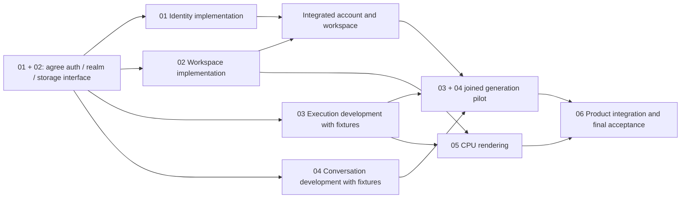

# Reigh Cloud: coordinated Megado projects

**Canonical metaplan for all six `-reigh-cloud` projects.** This document owns the shared execution schedule, project handoffs and integration sequence.

**Mode: planning only.** Requested decomposition into six delivery projects; no implementation, migration, paid call, deployment, or execution review has been launched. Every run uses the clear common suffix **`-reigh-cloud`**. These are work packages, not separate services. The existing architecture remains one small trusted Cloud deployment plus isolated agents and execution workers.

Canonical control root: `/Users/peteromalley/Documents/reigh-workspace/Astrid/.otto/runs/`, because Astrid is the invoking repository. Cross-repository source scope does not relocate control storage. Architecture stays in this design directory. Each project has its own `run.yaml`, `northstar.md`, `agent_goal.md`, `plan.md`, `tasklist.md`, and `status.md`.

## Shared direction

Deliver a Local/Cloud Reigh and Astrid experience. Cloud selection requires Supabase authentication, initially Discord; the same application account resolves the same personal Turso realm on every device. Runtime owns workspace and canonical task/session state, private storage holds media, and Supabase owns identity, billing and execution delivery. Native and hosted Astrid use the same scoped Cloud contract. OMP runs in disposable hosted sandboxes and persists native sessions via Runtime. The user selected simple measured-usage charging through one prepaid balance, automatic agent continuation after terminal task results, no arbitrary product quotas, and 24-hour paused-scratch retention after durable-state confirmation. Recommend 1× measured underlying cost with 0% markup for product confirmation. The customer-agent model starts on DeepSeek API `deepseek-flash` (DeepSeek-V4.1-Flash); record its actual returned alias target. E2B is the first smoke candidate, 2 vCPU/4 GiB initially, with provisional 90-second committed-idle pause. Agents submit tasks; API workers and a separate CPU renderer execute them. Preserve Local mode. Aggressively replace obsolete orchestrator paths; no legacy queue shims, dual writes or parallel old implementations. Reconcile in-flight jobs and preserve historical financial/data references when cutting over.

Inputs: [reviewed overview](cloud-mode-project-overview-2026-10-05.md), [integration plan](cloud-mode-integration-plan-2026-10-05.md), [readiness register](cloud-mode-specification-readiness-2026-10-05.md), and [Astra High review](cloud-mode-astra-review-2026-10-05.md). These supply existing research; do not rerun a whole architecture review merely because work is split into projects. [Source state](../../../Astrid/.otto/runs/reigh-cloud-source-state-2026-10-05.md) records refs, dirty paths and input digests; source edits remain unchosen until delivery kickoff.

## Projects

| Project | Outcome | Main source ownership |
|---|---|---|
| [01 — Identity and access](/Users/peteromalley/Documents/reigh-workspace/Astrid/.otto/runs/01-identity-access-reigh-cloud/plan.md) | Browser/native sign-in, account identity, grants, per-device mode selection and idempotent account-to-realm provisioning control | Reigh auth/UI, Supabase account/control functions, Astrid native login |
| [02 — Workspace and storage](/Users/peteromalley/Documents/reigh-workspace/Astrid/.otto/runs/02-workspace-storage-reigh-cloud/plan.md) | Hosted Runtime with one Turso DB per user, schema lifecycle, private blobs and bounded realm hosting | Workspace Runtime, its clients and cloud storage configuration |
| [03 — Execution and billing](/Users/peteromalley/Documents/reigh-workspace/Astrid/.otto/runs/03-execution-billing-reigh-cloud/plan.md) | One API capability through durable admission, job delivery, credit hold, provider execution, verified result and settlement; old orchestrator path removed | Runtime dispatch, Supabase jobs/ledger, API orchestrator |
| [04 — Agent conversations](/Users/peteromalley/Documents/reigh-workspace/Astrid/.otto/runs/04-agent-conversations-reigh-cloud/plan.md) | Native and hosted OMP chats persist, reconnect and safely transfer writer ownership; sandbox controller | OMP SessionStorage, Astrid entrypoints, Runtime conversation APIs, Reigh ACP transport |
| [05 — CPU rendering](/Users/peteromalley/Documents/reigh-workspace/Astrid/.otto/runs/05-cpu-rendering-reigh-cloud/plan.md) | Separate worker renders a frozen timeline using existing Astrid FFmpeg/Remotion adapters | Astrid renderer/image packaging and execution-worker registration |
| [06 — Product integration](/Users/peteromalley/Documents/reigh-workspace/Astrid/.otto/runs/06-product-integration-reigh-cloud/plan.md) | Joined Reigh experience, inactive-project import, portable export, end-to-end acceptance and operational/cutover readiness | Reigh remaining Cloud views, Runtime portability APIs, cross-repo integration |

## Dependencies and parallel work

[Astra’s parallel-delivery proposal](cloud-mode-parallel-delivery-2026-10-05.md) provides the rationale for the adopted three-worker rotation, shared-file ownership and separate start-versus-completion dependencies for all 30 tasks. The existing plans now apply this schedule; implementation has not started.

01 and 02 jointly agree the small interface first, then proceed independently; neither requires the other's whole project to finish before beginning. 03 and 04 can build against those fixtures while real dependencies mature. 05 can package/test the existing renderer early, but its joined proof uses 02/03. 06 can build UI and import/export fixtures early; final acceptance waits for real integrated evidence from all five. A generation-only pilot may precede CPU rendering; it is not completion of the full requested project.

## Coordinated execution schedule — adopted amendment

Keep six outcome-owning projects, but execute their tasks through **one coordinator and three active worker slots**, matching the current four-agent capacity. These slots are not new model roles or projects: each task still uses its own run's normal/xhard routing. Do not run six permanent project managers. Make a slot available for prescribed reviewer/oracle invocations rather than exceeding capacity.

| Scheduling window | Worker slot A | Worker slot B | Worker slot C | Joined outcome |
|---|---|---|---|---|
| Initial risks | WSP-01 Turso proof and lifecycle interface | IAM-01 then auth/native login/mapping | CONV-01/02 OMP durability and intent interface | Grounded identity, realm and durable-intent contracts |
| Usable foundation | WSP-02 and narrow WSP-03 | IAM-04/03 and WSP-05 provisioning join | EXE-01/02 and one EXE-03 handler | Account, realm, grant and atomic hold/job |
| First real flow | WSP-04 and gateway/provisioning fixes | CONV-01/02/03 then sandbox controller | EXE-03/04 and minimal result view | Durable turn → task → hold/job → fake provider → private result → settlement |
| Client experience | WSP-06/Runtime fixes; release slot when ready | CONV-04/05 and IAM-05 | PROD-01/03 and progressive PROD-04 | Cross-device resume, isolated accounts and hosted recovery |
| Remaining outcomes | CPU-01..04 | PROD-02 portability | Remaining EXE-04/05 and PROD-04 | Rendering and import/export join the same system |
| Completion | Highest-priority affected fixes | Corresponding evidence | PROD-04/05 completion | Full six-project acceptance and rollout readiness |

These are priorities, not global waves. A worker can move ahead when a task's **Start** dependencies are satisfied. CPU-01 packaging, UI fixtures and import/export reference mapping can start immediately and fill upstream waits. Their later default position protects early Turso/OMP/billing risk discovery; it does not create a new dependency. Reserve slots for CPU and portability after the first flow so generation polish cannot starve them.

The coordinator selects a ready task or bounded slice, names its owner and consumed contract revision, and integrates shared changes promptly. A task completes only when its **Complete** dependencies and acceptance proof are met. Fixture-backed partial work stays partial. Rotating workers leave a durable handoff in existing task/status notes; no extra run hierarchy is needed.

## Early convergence and integration discipline

Under existing **PROD-04**, join a small real persistence slice before every component is feature-complete: distinct account realms; acknowledged OMP turn/tool intent surviving hard kill; writer takeover rejecting stale appends and submissions; the actually claimed Runtime task bound to one atomic Supabase hold/job; a deterministic fake provider including lost acknowledgements; private verified output; and recovery after Runtime result commit but before ledger settlement. This is future delivery evidence, not tests already run. The fake provider avoids paid generation but does not replace real database/authorization checks in an authorized isolated test environment.

Next add hosted sandbox destruction/recreation, native second-device login, CPU delivery and inactive import/export with Local restore. Early convergence preserves every final PROD-04 dependency and cannot prematurely complete an upstream project.

Integrate after small completed interface/behavior slices, with a regular working-day checkpoint during sustained work. Fix a broken boundary before stacking dependent code. Keep existing review settings: these integrations are engineering checks, not new model-review gates. Worktrees remain a future custody choice and do not prevent semantic contract drift.

## Handoff ownership

- **01 → 02:** authenticated subject, grant claims, provisioning request/result, stable realm ID and revocation behavior. 01 owns account-to-realm mapping/provisioning state; 02 owns actual database creation/open/migration. Agree this once rather than implement two provisioners.
- **02 → 03/04/05/06:** authenticated Runtime endpoint, schema/version guarantees, managed object upload/read/publication and consistent workspace APIs. Subprojects add their own task/session schema changes through the same migration mechanism.
- **03 → 04/05/06:** stable task intent, delivery envelope, estimated-usage hold, cancellation, unknown-provider state, durable terminal-completion event, output receipt and usage settlement semantics. 04 owns stable turn/tool intent production; 03 consumes those identities without regenerating them.
- **04 → 06:** session lifecycle, accepted-turn IDs, committed history cursor, writer lease and sandbox lifecycle, plus deduplicated completion notification, queue/resume UI state and follow-on turn. Token streaming is transient; native history and consequential turn/tool records are durable.
- **05 → 06:** supported render capability, frozen-input contract, measured resource limits, progress/cancel and managed output.
- **06 joins all outputs:** complete user scenarios, import/export correctness, operating runbook and clean legacy cutover plan. It does not rebuild another auth, billing, session or task service.

When projects touch the same repository, use explicit file/API ownership and serial integration of shared migrations/client generation. Parallel project labels are not permission for concurrent incompatible edits. Delivery source custody must be selected before source mutation as required by Megado; this setup does not choose main or create worktrees. No deployment or destructive live cutover is authorized by completing a plan.

## Model and review policy

Each `run.yaml` is that run's sole model/stage/budget declaration. Skill default future role bindings are preserved; the available native tool exposes GPT-6 Luna rather than the template's GPT-5.6 Luna, so resolve model availability before any future bound delivery dispatch. Actual planning author uses the user-requested Luna family (`gpt-6-luna`, xhigh) and is recorded separately from future role bindings. Planning schedules no executable review stages. Do not turn the six projects into repeated reviews of the same whole system: each future review should own its concrete component contract, with the whole-system outcome covered by integration.

## Estimate and delivery milestones

| Project | Focused engineering days |
|---|---:|
| 01 Identity/access | 5–8 |
| 02 Workspace/storage | 10–16 |
| 03 Execution/billing | 8–13 |
| 04 Agent conversations | 6–10 |
| 05 CPU rendering | 4–7 |
| 06 Product integration | 8–13 |
| **Total effort** | **41–67** |

These are planning ranges, not measured throughput, agent wall-clock promises or a calendar schedule. The 41–67 engineer-day range is the prior scope baseline; durable completion notifications/follow-on turns and measured-usage settlement expand the work and require re-estimation at delivery kickoff, so the old range is not a completion guarantee. Parallel work can reduce elapsed calendar time but does not eliminate shared Runtime/client/migration integration. Turso transaction compatibility, OMP remote durability, deployed auth/billing state and provider uncertainty are the main estimate risks. Narrow probes can change these ranges; no upper bound automatically adds a review gate.

The first generation pilot joins 01–04 and the relevant UI work from 06 with one API capability. It excludes CPU rendering, broad capability coverage and general project migration. Full delivery also includes 05 and all of 06, including supported import/export and joined recovery evidence. A pilot is an explicit partial milestone, not completion of the whole goal.

## Planning status

The task lists describe future evidence, not tests already passed. Deployed provider/auth configuration, exact Turso driver, sandbox selection, DeepSeek alias compatibility, the proposed 1×/0% tariff confirmation and narrow failure/cancellation tariff remain validation decisions in the corresponding plans. Arbitrary user quotas are not planned; provider capacity and technical safeguards remain implementation concerns. Planning basis checked 2026-10-05: E2B 1/1 ≈ $0.0666/hour; 2/4 ≈ $0.1656/hour; 100 users × 0.5 active hours/day × 30 days at 2/4 is $248.40 compute + published $150/month Pro fee = $398.40 total E2B before model/storage/network. This is an illustration, not an approved budget. No user count or production load is otherwise invented. Plans use the dirty working trees as research evidence while preserving them; clean delivery pins and source custody remain delivery kickoff work.
