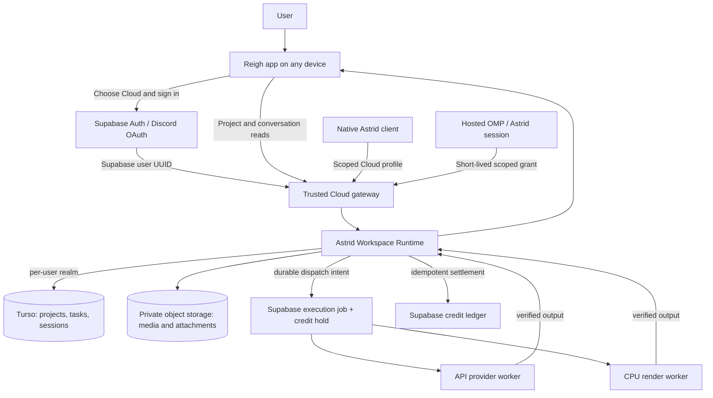

# Reigh and Astrid Cloud Mode: Project Overview

**Shared metaplan:** [Reigh Cloud — coordinated projects and execution schedule](/Users/peteromalley/Documents/reigh-workspace/reigh-app/docs/design/cloud-mode-megado-projects-2026-10-05.md).

**Status: architecture overview reviewed by Astra High; implementation and validation pending — 2026-10-05**

This document describes the intended cloud experience, the existing projects that can contribute to it, and the work needed to connect them. It is a readable overview, not an implementation record: repository code and migrations were inspected, but deployed Supabase configuration, live database schemas, credentials, and production services were not verified. “Exists” below means a source-level foundation was found; it does not mean the feature is live or ready to reuse unchanged.

For detailed evidence and engineering contracts, see the [Cloud mode integration plan](cloud-mode-integration-plan-2026-10-05.md), the [specification readiness and decision register](cloud-mode-specification-readiness-2026-10-05.md), and the linked research reports in [`cloud-mode-research-2026-10-05`](cloud-mode-research-2026-10-05/).

## Current user decisions (2026-10-05)

- Hosted agent inference starts with the DeepSeek API model alias `deepseek-flash` (DeepSeek-V4.1-Flash), using `https://api.deepseek.com`. The alias can move; record the actual returned model and date/version. Verify OMP tool calling, streaming, and usage reporting before delivery. This customer-agent choice does not change Megado project-run model configuration.
- A terminal task result automatically continues the originating agent plan. Runtime publishes a durable completion event; a trusted controller delivers it once to the associated conversation and schedules a follow-on turn. Success, terminal failure, and cancellation notify the agent without automatic retry. Queue behind an active turn; an active native writer receives the notification or queues it without writer takeover or duplicate sandbox launch. Wake a paused or expired sandbox with a current writer lease and fresh grant. A lost acknowledgement must not replay the prior LLM turn or duplicate a paid intent. A completion after the 24-hour scratch expiry may recreate the sandbox from durable state and continue.
- The user selected simple usage-based charging through one prepaid balance for measured model, allocated active-sandbox, generation, and render usage. Engineering tariff recommendation (not yet user-approved): charge 1× measured underlying cost with 0% markup. Reserve an estimate, settle verified actual usage once, and release unused hold. The recommendation charges completed provider work at measured usage even if the user dislikes the result; duplicate or infrastructure-fault charges are not passed through. Confirm tariff/rounding and the narrow failed, cancelled, or ambiguous-cost policy before live debits.
- There are no arbitrary product quotas for daily spend, conversation count/concurrency, or LLM budgets in the first release. Atomic balance reservation prevents overdraft; provider limits, scoped authorization, idempotency, one writer per conversation, and an operator emergency stop remain technical safeguards.
- The 24-hour paused-sandbox retention is accepted. After durable Runtime/BlobStore state is confirmed, delete the paused sandbox and scratch; this does not expire Turso conversation/task history. The provisional 90-second idle pause remains a controller default.

## The product we are aiming for

A person can use Reigh and Astrid on their computer in **Local** mode, where the workspace lives in local SQLite and local files, or choose **Cloud** mode, where their workspace is available after signing in. Their projects, conversations, tasks, and results belong to their account and can be opened on another device by signing into that same account.

The mode chooses which workspace Astrid reads and writes. It does not choose where the agent process runs. A native Astrid client can connect to the user’s Cloud workspace, and a hosted Astrid client can do the same. Local mode continues to use the local Runtime. Changing modes selects a different workspace; it does not silently copy, merge, or synchronize data, and it does not move a task that has already been admitted.

For the first cloud release, Astrid agents submit tasks. Reigh provides sign-in, project and conversation views, account and credit information, task status, and results. An agent can request image or video generation and can ask Astrid to render a timeline. The agent process can stop and later resume because the conversation and workspace are stored independently of its machine.

## Cloud sign-in and using another device

**Yes, Cloud mode requires an account sign-in.** The intended first sign-in option is the existing Supabase Auth integration with Discord OAuth. Selecting Cloud should take a signed-out user through that sign-in flow. Once Supabase confirms the login, Reigh receives the authenticated Supabase user UUID and asks the trusted server side to open that user’s cloud workspace.

Discord is the sign-in provider; the Supabase Auth user UUID is the stable application identity. The database mapping must use that UUID, not a Discord username, display name, or provider-specific ID. That gives the account one stable Turso realm mapping even if the person changes Discord profile details or uses a different device. Discord is not the database key.

On a second device, the user signs into the same Supabase account through Discord. The server resolves the same Supabase user UUID and opens the same personal Turso realm. The user then sees the same cloud projects, conversations, task history, and results. Each device may have its own temporary login session and local cache; neither is the owner of the cloud data.

The current source contains Discord OAuth and billing-related integration, but the current Reigh auth context was found in a local/sessionless bridge state. Therefore the sign-in path is a **reuse-and-reconnect task**, not a verified functioning Cloud flow. Restore the correct AuthProvider/session behavior, confirm the deployed Discord provider and callback URLs, and test refresh, logout, expired sessions, account switching, and login on a second device. On logout, clear that device’s local session and revoke its applicable grants; distinguish device logout from account-wide revocation and task cancellation. Already-admitted tasks remain associated with the account. Whether a hosted turn continues after browser logout is an explicit product decision. On account switch, close the old Cloud workspace before resolving the new account. A local profile must never be treated as an authenticated billable Cloud identity.

The Local/Cloud selection should be remembered as a device preference, while the account identity and personal Cloud realm are resolved from the current sign-in. Signing in on another device should open Cloud data, but it should not import that device’s Local projects. Local-to-Cloud movement is a separate, explicit, resumable import operation.

Conversations also need a cross-device rule. Their canonical OMP records live with the user’s Cloud workspace, so another device can view history and resume the same session. To avoid two agents writing divergent turns to one transcript, allow one active writer per conversation at a time. A second device may view the conversation or explicitly take over after the existing writer is stopped or its lease expires. Runtime must fence session writes and new task submissions with the current writer generation so a stale process cannot continue mutating Cloud state; already-admitted tasks keep their own execution identity. Supporting simultaneous parallel turns would require a separate branching/merge product decision.

Native Astrid needs its own browser-based authentication handoff, such as a supported PKCE callback or a one-use device handoff; the exact Supabase configuration remains to be validated. Store native refresh credentials in the OS credential store, not prompts or workspace data. Concurrent first logins must call an idempotent realm-provisioning operation so they adopt one database, with explicit pending/ready/failed state and recovery from partial provisioning. Each realm needs schema-version checks and controlled migrations. Do not silently create a replacement empty database on an open or migration error.

## How the parts fit together

The Runtime is the authority for the creative workspace and canonical task lifecycle. Supabase is the authority for sign-in, account identity, billing and the separate execution-delivery records. Workers receive delivery instructions but report task progress and completion back through Runtime’s lease and fencing rules. Supabase job status is transport/operations state; it is not another copy of the workspace task.

In Local mode, Reigh and Astrid use the existing local Runtime, SQLite database and local content-addressed media. In Cloud mode, they use the hosted Runtime backed by the user’s Turso database and private media storage. Do not put Turso credentials in the browser or agent process; use authenticated, scoped Runtime APIs.

## Projects and reuse

| Project | What it already contributes | What Cloud mode adds |
|---|---|---|
| **`reigh-app`** | React/Vite interface, local Runtime connection, ACP chat bridge, project/timeline UI, Supabase Auth/Discord and Stripe-related code, historical account/credit migrations, typed task-admission client | User-selectable mode, restored Cloud auth behavior, cloud workspace client/views, hosted chat transport, and updated billing/execution integration. The existing deferred Supabase data provider is a build-time switch, not the desired user-facing cloud workspace. |
| **`Astrid`** | CLI/SDK, capability definitions, generation and creative tools, task admission, rendering adapters | A profile-aware authenticated Cloud Runtime client, bounded permissions for Cloud agents, and shared behavior for hosted and native Cloud-connected agents. |
| **`banodoco-workspace-runtime`** | Canonical SQLite-backed projects, media records, timelines, tasks, attempts, events, leases and settlement rules | Turso-compatible storage, authenticated network service, private BlobStore, and durable dispatch/outbox integration. Its current implementation relies on local SQLite and filesystem assumptions, so this is significant adaptation. |
| **`oh-my-pi` (OMP)** | Agent conversations and native session record format; a pluggable session-storage seam, including another storage backend as a precedent | A Runtime-backed session-storage implementation wired into CLI, TUI and ACP so local and hosted Astrid sessions persist and resume through the selected workspace. |
| **`reigh-worker-orchestrator`** | Existing API provider handlers, especially fal/Wavespeed submission, polling and output retrieval | An adapter to the new Runtime task envelope and separate delivery jobs. Its legacy Supabase queue and combined completion path cannot remain task authority. |
| **New CPU render worker** | Astrid’s `rendering.render` / `render_export` task adapter, FFmpeg and Remotion paths | A pinned, isolated worker package with resource limits, cancellation, progress and verified output publication. |
| **Managed sandbox service** | No complete hosted conversation controller was found | A thin host controller to start and stop agent sandboxes, inject short-lived grants, stream/replay chat events and reopen durable OMP sessions. E2B is a leading candidate; it still needs a prototype and selection. |

The separate `reigh-worker` GPU/local worker is not required for the API-only first phase. Start by adapting the existing API worker code. Add GPU worker hosting when a supported capability requires it.

## Clean replacement policy

**User decision:** replace obsolete execution architecture aggressively. The cloud orchestrator has one supported task contract and one execution path. Port useful provider request/poll/download logic into that path, then remove the old queue consumer, legacy task payload handling, startup status resets, old completion/billing calls, compatibility shims, fallback switches and their obsolete tests/configuration. Do not maintain parallel orchestrator versions. Provider-specific handlers implementing the new contract are ordinary implementation code, not legacy compatibility adapters.

Cutover must account for already-running work and preserve required historical account, payment and task records. Drain or explicitly reconcile old in-flight jobs, switch deployment, and remove the obsolete runtime paths. Historical data and applied migration history are not a reason to retain old executable behavior; retiring tables must first resolve their ledger references. This is the implementation direction, not authorization to erase financial history or evidence that any deletion has already occurred.

## Where the data lives

| Data | Intended home |
|---|---|
| User identity, Discord-linked Supabase Auth session, account/profile, Stripe references and credits ledger | Supabase |
| Mapping from Supabase user UUID to that user’s personal Runtime/Turso realm; scoped grants and sandbox placement | Supabase control plane |
| Projects, timelines, media metadata, canonical tasks/attempts/events/results, OMP conversation/session records | Astrid Runtime; SQLite locally and one Turso database per user in Cloud mode |
| Images, videos, audio, attachments and large artifacts | Local media store in Local mode; private object storage in Cloud mode |
| Temporary render inputs, downloads and agent process files | Disposable local/worker/sandbox scratch space |
| Execution delivery jobs and credit holds/settlement events | Supabase, linked by stable Runtime task ID and idempotency key |

Turso stores structured workspace data and OMP’s native session records. Object storage holds large bytes. The Runtime owns metadata, hashes, ownership and references and verifies uploaded bytes before publishing them. Use a private bucket behind a BlobStore interface; existing public-readable upload policies are not suitable for private workspace files by default. Large media should upload directly through a resumable flow rather than through an Edge Function request body.

## A task from conversation to result

1. The user signs into Cloud mode. Supabase Auth identifies the account; trusted server code maps the Supabase user UUID to its personal Runtime realm.
2. Reigh opens a conversation. OMP loads or creates its native session through Astrid Runtime storage. The agent receives a scoped grant for allowed projects and capabilities.
3. The agent submits a typed task with a stable intent/idempotency key. The server checks ownership and capability bounds, estimates the usage hold against the prepaid balance, and records the canonical task plus durable dispatch intent.
4. A dispatcher obtains the actual Runtime task/attempt claim, then creates the corresponding Supabase execution job and credit hold idempotently. Do not assume the existing Runtime supports claiming an arbitrary task by ID; the dispatcher must respect its actual claim order and verify which task it received.
5. An API worker or render worker processes the delivery. It uses provider request IDs and reconciliation so an ambiguous timeout does not blindly submit duplicate paid work. The worker has no authority to rewrite workspace task state directly.
6. The worker uploads output privately. Runtime verifies digest, size and media type, publishes the object reference, and completes the task using the current lease/fence. Billing settles through an idempotent ledger event. Unknown provider outcomes remain held for reconciliation rather than being charged twice or prematurely refunded.
7. Reigh and the agent read the same result and task status. The conversation links to the task/result so it can be resumed on another device.

The first supported task set should be deliberately narrow: agent-submitted external API generation, followed by a separate CPU render path. Direct UI task submission can be added after the agent contract is stable.

## Billing approach

Reuse the existing account, credits ledger and Stripe checkout/webhook mechanisms where source review confirms they are still the intended product path. Existing migrations include fractional precision (`numeric(10,3)`); treat credits and displayed currency units carefully because the source contains different historical conventions. Reconcile the live migration state, balance units and current tariff calculations before changing anything.

Use one prepaid balance for measured usage across model inference, allocated active-sandbox time, generation, and rendering. Record provider-reported model usage per request (available input, output, cached and reasoning token details normalized to avoid double counting overlapping totals) and sandbox allocated-resource seconds, attributed to account and conversation; aggregate at full provider precision before ledger rounding. Sandbox usage is elapsed allocated vCPU/RAM time, not sampled CPU utilization. Reserve an estimated amount before work, settle verified actual billable usage once, and release the unused hold. Completed provider work incurs its measured usage even if the user dislikes the output; duplicate or infrastructure-fault charges are not silently passed through. The simple usage direction is settled, while markup and the narrow failed/cancelled/ambiguous-cost tariff still need a product decision. Do not create a separate fixed-quote generation scheme or double-charge provider/render work. These are planning decisions, not live billing behavior.

Legacy Supabase tasks and their billing foreign keys must not be used to mirror the new Runtime task/project tables. Add a trusted Runtime-task reference and unique billing event/reservation identity so concurrent claims and retries cannot debit twice. Stripe purchase idempotency and mature ledger pieces are useful precedent; they do not provide the cloud task hold/settlement protocol by themselves.

## Hosted conversations and rendering

OMP’s native session-storage interface is the best place to add persistence. Implement the interface against Astrid Runtime so session creation, append, title changes, truncation, branch/fork operations and flush/drain behavior survive process loss. Wire that backend into all branded Astrid entry points, not just Reigh’s browser chat. Reigh should display a projection of the native conversation records and event stream instead of maintaining a separately editable transcript.

Cloud OMP runs inside an isolated sandbox supplied by the selected compute host; E2B is the first candidate, pending smoke and recovery proof. The current estimate uses E2B published compute rates ($0.000014/vCPU-second and $0.0000045/GiB-second): 1 vCPU/1 GiB is about $0.0666/hour and 2 vCPU/4 GiB about $0.1656/hour. At 100 users × 0.5 active hours/day × 30 days, the larger profile is 1,500 hours or $248.40 in sandbox compute; adding E2B Pro's published $150/month shared platform fee gives $398.40 total E2B cost, before storage, model inference, bandwidth or taxes. Treat these as planning inputs to recheck at implementation. Start the prototype at 2 vCPU/4 GiB; right-size to 1/1 only if OMP/skills pass measured memory and latency needs. Reuse a pinned sandbox template; do not build an image per conversation.

The controller starts or resumes a conversation sandbox when a turn is admitted, keeps it while active, and provisionally pauses after 90 seconds idle at a safe durable turn/tool boundary. The timer belongs to the controller and must be fenced by a lifecycle epoch; browser disconnect or network timeout alone is not an idle or cancel signal. On controller restart, reconcile actual provider state, usage attribution and a lost pause acknowledgement; this reconciliation does not stop provider billing that has already accrued. E2B documents roughly 1-second resume and roughly 4 seconds/GiB pause, but these are estimates rather than app SLOs; paused sandboxes retain memory/filesystem, disconnect network clients that must reconnect, and have no automatic TTL. Resume must refresh scoped grants and reconnect/replay ACP from committed state. Background tasks continue under their own task lifecycle and do not keep the chat sandbox alive; a resumed conversation gets a fresh grant and cannot revive an old writer. A terminal task result automatically continues the originating agent plan through a durable Runtime completion event and controller inbox. The controller deduplicates by stable event ID, queues behind an active turn, or wakes/recreates the conversation sandbox with a current writer lease and fresh grant; it resumes from committed native OMP state rather than replaying the prior LLM turn. Success, terminal failure, and cancellation notify without automatic retry. Completion while a native writer is active is queued/notified without taking over the writer or launching a duplicate host. A completion after scratch expiry may recreate the sandbox from durable state. The accepted 24-hour paused retention deletes scratch after durable state is confirmed but leaves Turso history intact. Scratch promotion/portability and provider-side usage reconciliation still need implementation proof; no artificial user quota is required. A failed pause must be visible and retried/reconciled because a still-running sandbox continues accruing cost. Runtime/Turso and BlobStore remain canonical; do not persist the entire agent home or credentials.

Video rendering runs as an asynchronous CPU worker, apart from the interactive agent. It can reuse the existing Astrid adapter, which freezes timeline inputs, stages files and selects FFmpeg or Remotion. Package pinned dependencies and fonts, track progress/cancellation, verify the output and measure memory, CPU, disk and duration before setting quotas. “Light” video rendering should not be assumed without measurements.

## Work to get there

1. **Reconfirm the source and deployed baseline.** Select clean commits, inspect the applied Supabase migration ledger/functions and Discord OAuth callback configuration, and reconcile account provisioning, RLS, currency units and current tariffs. The repositories inspected for the plan had dirty working trees; their HEADs are evidence points, not deployment pins.
2. **Prove authentication and identity across devices.** Restore the Supabase session provider, map authenticated Supabase UUID to a personal realm, and exercise Cloud selection, refresh, logout, expired token, account switching and second-device login. Verify Local mode cannot make billable Cloud calls and mode switching never imports data implicitly.
3. **Prove the Runtime-to-Turso contract.** Pick the Python driver/engine through a conformance spike for transactions, schema upgrades, uniqueness, event sequencing, claims, lease fencing and restart behavior. Keep a single owner per realm until cross-host ownership is proven.
4. **Add private media storage.** Implement BlobStore, resumable uploads, integrity checks, tenant authorization, signed delivery URLs and orphan cleanup. Verify large files and interruption/retry behavior.
5. **Build task dispatch and billing recovery.** Define the task envelope, execution job, usage estimate/reservation, provider request, result receipt and settlement idempotency. Exercise duplicate delivery and crashes with a fake provider before paid calls.
6. **Persist OMP sessions through Runtime.** Implement and wire the native storage backend; prove a session can be resumed after the agent process and sandbox are destroyed. Add one-writer-per-conversation coordination and event replay.
7. **Connect Reigh and the host controller.** Add the Local/Cloud selection, sign-in/account views, hosted chat lifecycle and shared conversation/task/result views. Prototype E2B first; settle provider, image pinning, egress and sandbox limits using actual recovery and security tests.
8. **Add the first API and rendering workers.** Adapt one bounded API capability first. Then package the CPU render worker and measure resource envelopes and provider limits.
9. **Add explicit Local-to-Cloud import and staged rollout.** Copy media, verify hashes, import a consistent project manifest with stable ID mapping, report parity and let the user choose cutover. Roll out behind a small staged cohort with recovery and spend limits.

## Astra High review: changes to the recommended first release

An independent [Astra High review](cloud-mode-astra-review-2026-10-05.md) supports the core split and identifies several required clarifications. The following refinements are incorporated into this overview as engineering recommendations; they do not claim tested implementation.

- **Use one trusted Cloud service initially.** The gateway, realm routing, dispatcher, result ingestion and reconciliation can be modules in one deployment. Keep the Supabase execution-job table as the delivery queue and Runtime outbox rows as durable intents. A thin Edge Function is optional ingress, not a reason for several extra services. Prove bounded active realm contexts or supervised subprocesses on one host; one database per user does not require one permanently running machine per user. Keep live execution leases serviced before evicting an idle realm. This beta topology does not promise high availability.
- **Acknowledge durable turns, not merely queued writes.** OMP’s remote storage can queue publication; prove flush/drain semantics at consequential boundaries. Persist a stable user-turn operation ID before acknowledging acceptance and a stable tool-intent ID before side effects. Correlate both with native session entries. After a crash, display an interrupted turn and recover already-admitted tasks rather than automatically replaying the LLM turn. Committed session revisions support reconnect; token-by-token ACP replay can wait.
- **Specify recovery ownership.** One coordinator renews Runtime execution leases and reconciles after restart. If a provider accepted work but its acknowledgement was lost, the job is explicitly unknown until provider lookup or operator resolution establishes the outcome. Never blindly resubmit paid work. Retain verified but stale results for controlled recovery. Show aged holds, unknown submissions and recovery actions to operators; cap platform exposure to failed/cancelled work.
- **Define durable files separately from durable chats.** Register project artifacts, attachments and referenced media through Runtime. Scratch files, old absolute paths and terminal processes do not automatically survive machine changes. New devices resolve managed IDs into their own staging paths. Cloud network loss pauses/fails Cloud mutations visibly and may preserve an unsent draft; it never silently switches writes to Local.
- **Deliver a narrow pilot before general migration.** Start with new Cloud projects, one API capability, native and hosted agent access, simple measured-usage billing and explicit interrupted/unknown states. Add inactive-project import and portable Cloud export with a demonstrated Local restore before broad migration of valuable work. Imported historical tasks must not recreate jobs or charges. Define deletion/retention and operational recovery. CPU rendering is the next measured worker lane within the overall project.
- **Defer optional machinery.** No permanent per-user service fleet, distributed ownership platform, second editable transcript, automatic interrupted-turn replay, token-perfect streaming replay, general scheduling, multi-provider hosting/storage matrix, team tenancy or automatic Local/Cloud synchronization is required for the first release.

The source-backed review also spells out security minimums, native authentication, schema lifecycle and a revised rollout sequence. Those recommendations narrow deployment complexity while retaining the user’s chosen account, database and agent-only execution model.

## Remaining tariff details and implementation proof

The architecture direction and key product choices are settled. The 1×/0% usage tariff below is a recommendation for product confirmation, not approved live billing:

| Decision / remaining proof and owner | Current decision or engineering recommendation | Remaining proof or product input |
|---|---|---|
| Usage charging and narrow tariff policy — **03** | User-selected direction: one prepaid balance and measured usage. Proposed tariff: 1× measured cost, 0% markup; reserve estimates, settle verified actual usage once, release unused hold. | Confirm tariff/rounding and failed, cancelled, ambiguous-cost treatment before live billing; verify actual-usage reconciliation. |
| Product quotas and provider route — **03 + 04** | No arbitrary beta daily, concurrency, or LLM-budget quotas. Preserve atomic prepaid-balance reservation, provider-imposed limits, and operator emergency stop. | Verify usage accounting and provider capacity handling; no product cap values are required. |
| Initial customer-agent model and key custody — **03 + 04** | DeepSeek API `deepseek-flash` alias (DeepSeek-V4.1-Flash), called through the trusted server-side inference broker; keep its master key out of sandboxes. The alias is mutable. | Record actual returned model/date and verify OMP tool-call, streaming, and usage compatibility. The model choice is separate from Megado run roles. |
| Sandbox lifecycle and retained scratch — **04**, with **06** for product behavior | Start/resume per admitted turn, keep while active, pause after provisional 90-second idle at a committed safe boundary; delete after the accepted 24 hours paused once durable state is confirmed. | Provider smoke verifies pause/resume/destroy and scratch contents. Decide whether any scratch file needs managed-blob promotion; controller owns epoch/fencing, failed-pause reconciliation and provider TTL cleanup. |
| Sandbox size, host and platform overhead — **04** | E2B first candidate; start at 2 vCPU/4 GiB and right-size to 1/1 only after workload proof. Reuse a pinned template. | Bounded smoke and OMP/skill workload measurements; recheck current rate card, plan fee, network/storage costs. Provider pause/resume figures are estimates, not app SLOs. |
| Conversation concurrency and lifecycle — **04 + 06** | One active writer per conversation, one sandbox per active conversation initially; browser disconnect does not stop work, and independent background tasks do not keep chat sandboxes alive. | Verify notification/queue behavior for an active native writer and stale-writer rejection. No artificial account conversation quota is planned. |
| Agent continuation after task completion — **03 + 04 + 06** | Every terminal success, failure, or cancellation emits a durable completion notification and continues the originating agent plan once; do not replay the prior LLM turn. | Prove durable event/outbox delivery, controller inbox dedupe/ack, active-turn/native-writer queueing, expired-sandbox recreation, revocation, and no duplicate paid intent. |
| Durable storage and cross-device handoff — **02 + 04** | Turso/Runtime and BlobStore own canonical data; paused filesystem is disposable cache. Resume refreshes grants and replays from committed OMP state. | Turso driver conformance and sandbox destroy/recreate proof; decide transcript/object retention and deletion policy. |
| Native-to-hosted auth and provider billing identity — **01 + 03 + 04** | Native profile obtains short-lived scoped Runtime access; hosted process uses server-minted scoped grants. Browser authentication and inference billing are separate identities/flows. | Prove callback, grant refresh/revocation, trusted inference gateway and request-to-account attribution without master credentials. |

Provider pricing basis used above (checked 2026-10-05): [E2B pricing](https://e2b.dev/pricing) lists $0.000014/vCPU-second and $0.0000045/GiB-second and a $150/month Pro platform fee plus usage; [E2B persistence docs](https://docs.e2b.dev/sandbox/persistence) describe approximate resume/pause timings, retained paused memory/filesystem, network disconnect/reconnect and no automatic paused TTL; [E2B enterprise docs](https://e2b.dev/enterprise) state paused sandboxes are not billed. Validate these provider terms when selecting the production account and plan.

The likely overengineering traps are running two authorities for workspace tasks, building general multi-user/team sharing before personal cloud mode works, supporting many providers/capabilities at once, replicating or merging Local and Cloud automatically, and storing whole machine profiles to preserve chats. Keep one personal realm, one canonical Runtime task lifecycle, one supported generation capability, private object storage, and OMP-native session persistence as the first vertical slice. Add team tenancy, simultaneous conversation writers, broad job scheduling, general model metering and alternate storage/hosting backends only when a concrete requirement justifies them.

The largest implementation risks are the Runtime’s current local SQLite/filesystem assumptions, correct OMP storage-backend wiring across every Astrid entry point, and exactly-once-enough coordination across Runtime task claims, Supabase credit holds and external provider requests. These need executable prototypes; a diagram alone cannot establish their behavior.

**Not done:** this overview does not implement code, apply migrations, inspect live services, perform imports, deploy workers or make paid provider calls.
